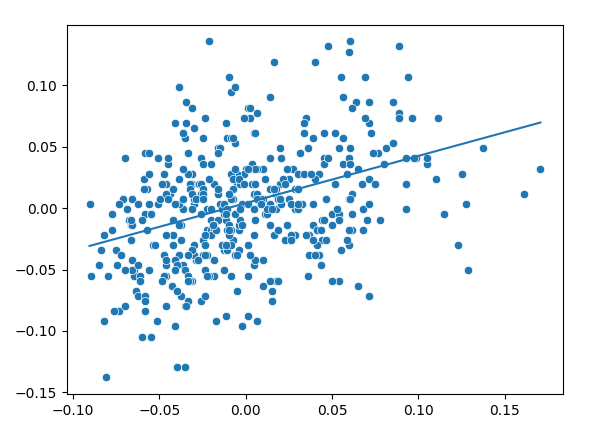

# Python regression model

This is a basic python regression model I made from scratch after learning aboutt regression techniques.

## How it works
The goal is to find the best fitting line based on data points on a 2D graph.

We define $X$ as the set of X values of all datas and $y$ to the corresponding y values.

We define the weight $w$ and the bias $b$ as random numbers.

We then have the linear relation $\hat{y_{i}} = wX_{i} + b$ where $\hat{y_{i}}$ represents the predicted value at $i$.

we define the `learning rate` ($LR$) as a small value that will multiply the derivative while performing the gardient descend, tipycally `0.01` or `0.001`.

> We then perform $n$ iterations of the following logic : 

Iterating from 0 to the size of the training set as $i$, at each iterations we calculate
$\hat{y_{i}} = wX_{i} + b$
Then we calculate the Loss $L$ with the Mean Squared Error formula, $L = (\hat{y_{i}} - y_{i})²$. We then find the derivative of the Loss function in respect to $w$, named $dw$. We have $dw = \frac{\delta L}{\delta w} = 2(\hat{y}_{i} - y_{i}) . \frac{\delta \hat{y}_i}{\delta w}$, following the chain rule. We then notice that $\frac{\delta \hat{y}_i}{\delta w}$ is equal to $X_i$ (derivate $\hat{y}_i$ in aspect to $w$). We have $dw = $2(\hat{y}_{i} - y_{i}) . X_i$. We do the same with $db$, the derivative of the loss function in respect to $b$, which is $2(\hat{y}_{i} - y_{i})$.

We then update $w$ as $w . dw . LR$ and for $b$ we update as $b . db . LR$.

Over time, the loss should decrease and the line should fit better to our datapoints.

### Example
Using the `diabetes` sklearn dataset, where X is the BMI and y is the blood sugar level, we have

